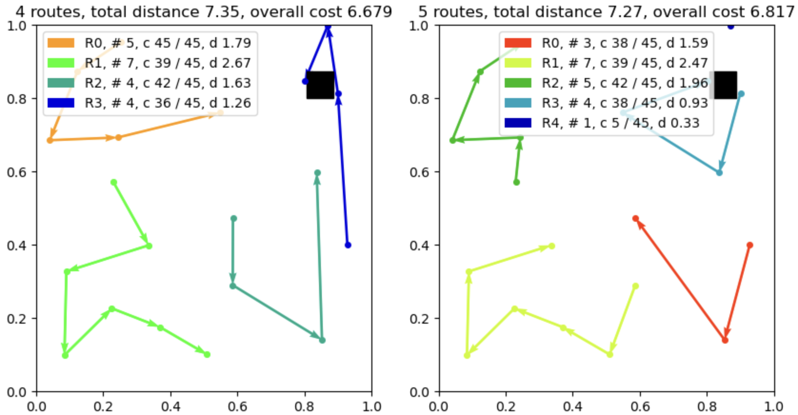
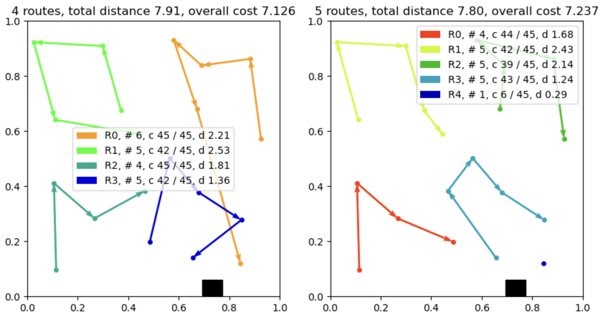

# [CS470 Team 23] School Bus Routing Problem with Attention Model
s
We use attention model to solve SBRP considering number of routes. Taking number of routes (reprensenting the bus on SBRP) into account, we trained our own model instance with new objective function.

Our implementatin is mainly on the `problems/vrp/problem_vrp.py` and the class `CVRP_BUS` inside it.
We also implement more real-world like validation data generation on `generate_data_cvrp_bus.py`.
Our train result is on `team23_model` directory which are used on `result_team23.ipynb` (for epoch 99).



## Paper
Most of code implementation is based on the source code from [repository](https://github.com/wouterkool/attention-learn-to-route) of the paper [Attention, Learn to Solve Routing Problems!](https://openreview.net/forum?id=ByxBFsRqYm) which has been accepted at [ICLR 2019](https://iclr.cc/Conferences/2019)


## Dependencies

```bash
team23_env.yml
```

## Usage

### Generating data

Training data is generated on the fly. 
To generate validation as used in result_team23.ipynb

```bash
python generate_data_cvrp_bus.py -f --graph_sizes 20 
```

### Training

For training our model instance with new objective function:

```bash
python run.py --problem 'cvrp_bus'  --graph_size 20 --baseline rollout --run_name 'cvrp_bus_20_rollout'
```

The output will be saved on `outputs/cvrp_bus_20` directory.

### Evaluation of the model and Visualization
See `result_team23.ipynb` for an example of loading a pretrained model and plotting the result for Capacitated VRP with 20 nodes.
We compared our model with new objective function and previous pretrained model with naive distance objective on this jupyter notebook with 10000 validation data. 

Below is the one of the comparisons. You can check the `result_team23.ipynb` for more cases.



### Other options and help
```bash
python run.py -h
python eval.py -h
```


## Acknowledgements
Thanks to [wouterkool/attention-learn-to-route](https://github.com/wouterkool/attention-learn-to-route) for making us to reproduce our product.